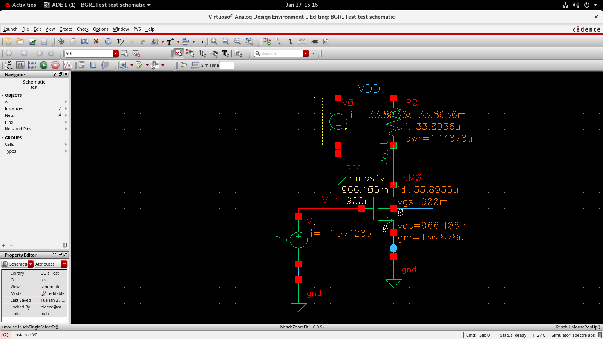
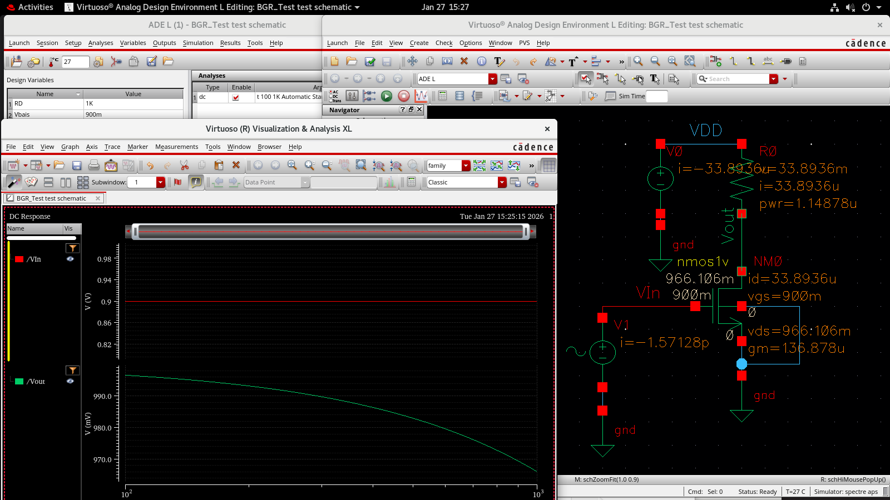
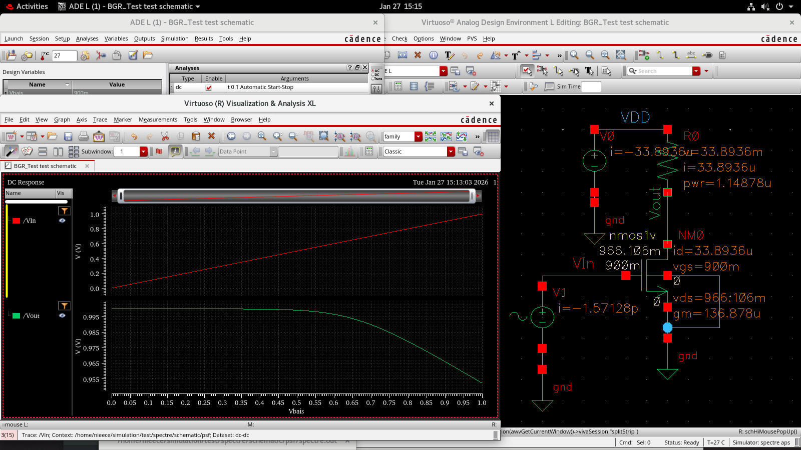
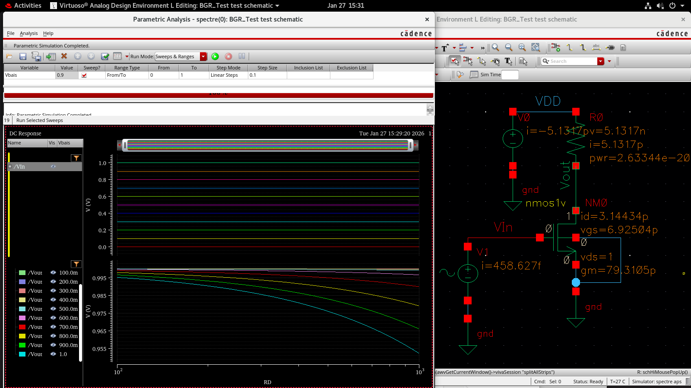
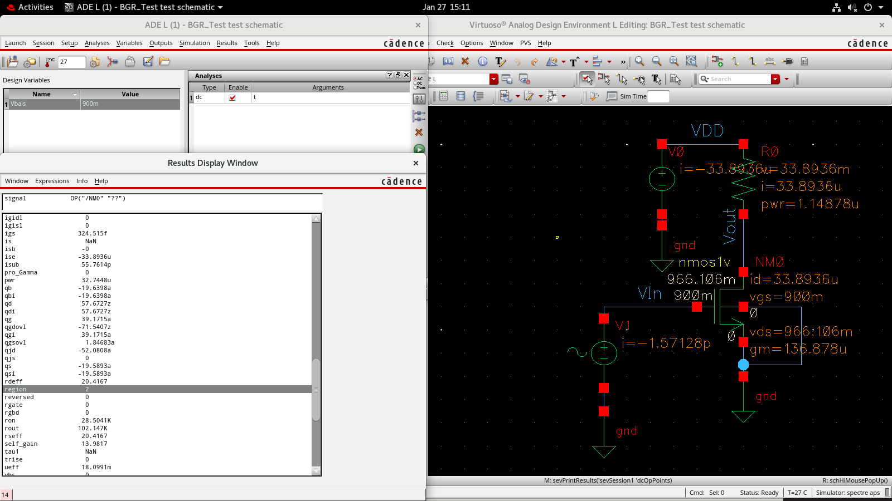
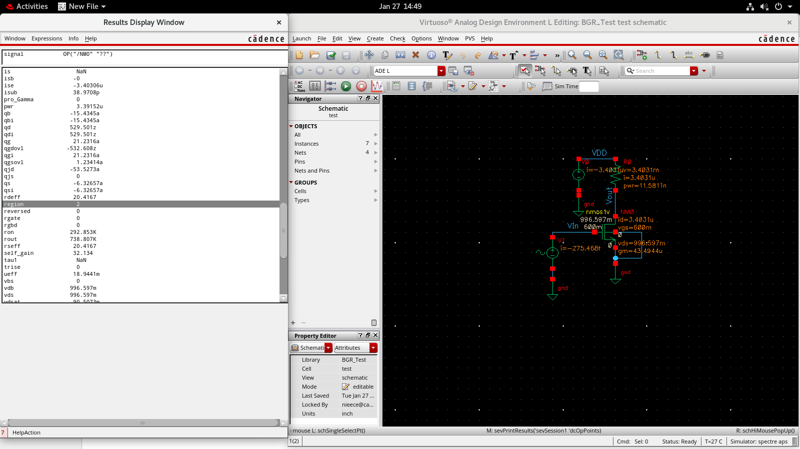
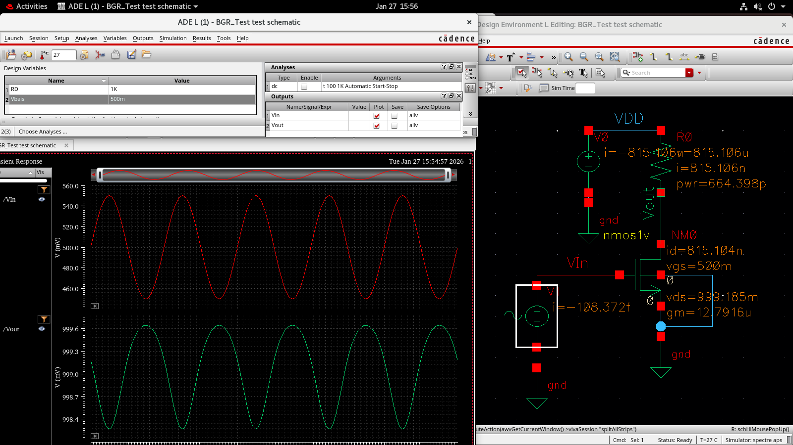
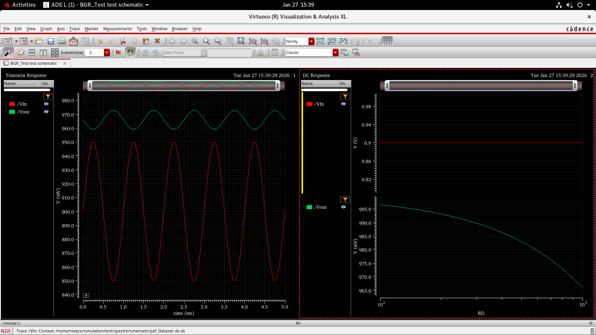
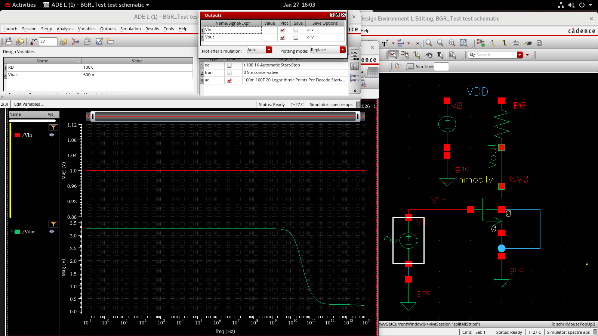
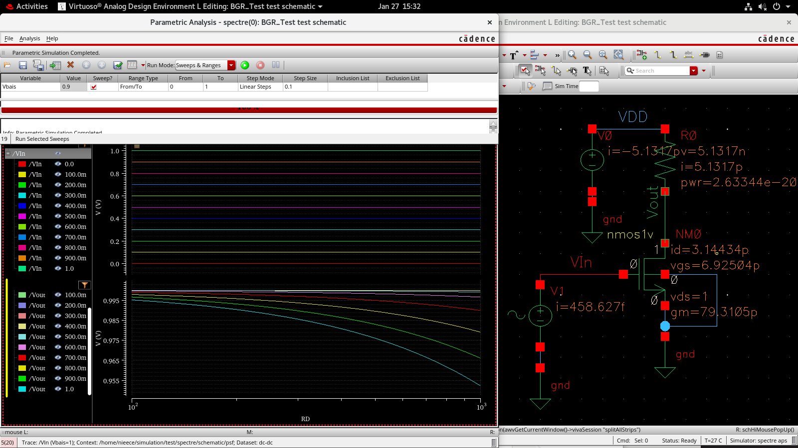

# Day 1 – Introduction to Analog IC Design & Bandgap Reference (BGR) Analysis and Familiarisation of Cadence Virtuoso Tool

## Overview
Day 1 focused on building a strong foundation in analog IC design concepts and applying them through detailed analysis of a Bandgap Reference (BGR) circuit using Cadence Virtuoso. The objective was to understand device operation, biasing, and the purpose of different simulation analyses.

---

## Analog IC Design Fundamentals

Analog IC design deals with continuous-time signals and is highly sensitive to device non-idealities, temperature variations, and process variations. Unlike digital circuits, analog circuits require careful biasing and verification.

### Topics Covered
- Introduction to analog IC design
- MOSFET operation principles
- Regions of operation of MOSFETs
- Importance of biasing in analog circuits
- Overview of DC, transient, and AC analyses in Cadence Virtuoso

---

## MOSFET Operation and Regions

MOSFETs are the primary active devices in analog IC design. Their region of operation determines circuit behavior.

### Regions of Operation
- **Cutoff Region**: Transistor is OFF; no conduction
- **Triode (Linear) Region**: MOSFET behaves like a voltage-controlled resistor
- **Saturation Region**: MOSFET behaves like a current source (preferred for analog design)

Proper biasing ensures operation in the desired region, especially saturation.

---

## Bandgap Reference (BGR) Circuit

### Circuit Implementation
A Bandgap Reference (BGR) circuit was implemented to understand reference voltage generation and bias stability. The schematic was designed and verified using Cadence Virtuoso.

---

## Simulation Analyses Performed

### 1. DC Analysis
DC analysis was used to:
- Verify the operating point of the BGR circuit
- Ensure proper biasing of transistors
- Confirm correct regions of operation
- Validate node voltages and branch currents

---

### 2. Region of Operation Study
Bias voltages were varied to analyze MOSFET operation under different conditions:
- Cutoff region
- Saturation region at multiple bias voltages

This region shows the cutoff region

This region shows the saturation region at 900m.

This region shows the saturation region at 600m.
This study reinforced the relationship between biasing and transistor behavior.

---

### 3. Transient Analysis
Transient analysis was performed to observe:

- Startup behavior of the BGR circuit
- Time-domain response
- Settling characteristics
- Comparison between transient response and DC operating point

---

### 4. AC Analysis
AC analysis was carried out to study:
- Small-signal behavior of the BGR circuit
- Frequency response characteristics
- Gain behavior around the operating point

---

### 5. Parametric Analysis
Parametric analysis was used to observe the effect of varying parameters on circuit performance. This helped in understanding sensitivity and robustness of the BGR design.

 
---

## Files Included

### Images
The `BGR_Test_Analysis_images/` folder includes:
- BGR schematic
- DC analysis results
- AC analysis results
- Transient analysis results
- Region of operation studies
- Parametric analysis plots
- Comparision of the dc and transient analysis

### Cadence Files
The `BGR_Test_Cadence_simulation/` folder contains:
- Cadence Virtuoso project files used for BGR design and simulation

---

## Key Learnings
- Analog IC design requires careful biasing and verification
- MOSFET region of operation strongly affects circuit behavior
- DC analysis is essential before transient and AC analysis
- Transient analysis reveals startup and time-domain behavior
- AC analysis provides insight into small-signal performance
- Parametric analysis helps evaluate circuit robustness

---

## Conclusion
Day 1 established a strong foundation in analog IC design concepts and simulation methodologies through hands-on analysis of a Bandgap Reference circuit. 
