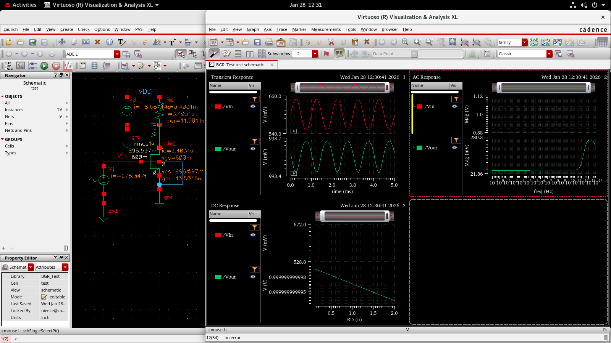
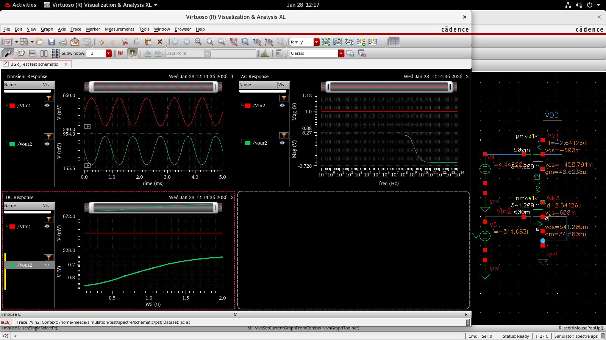
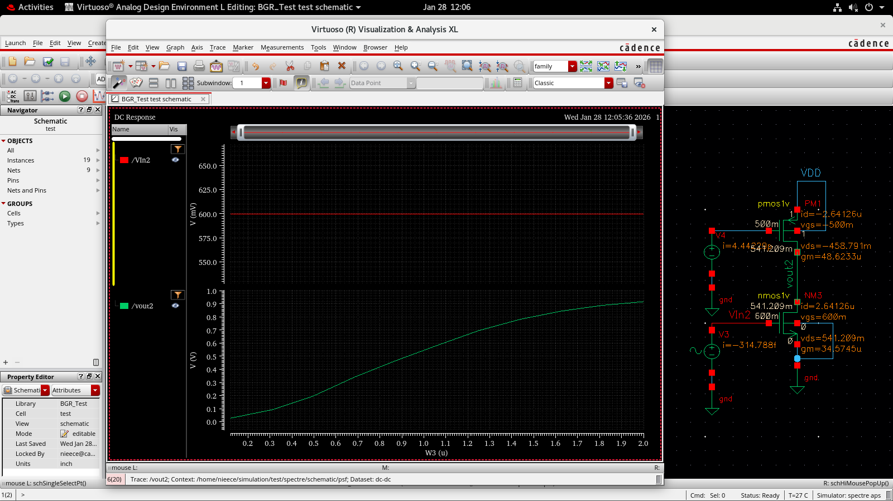
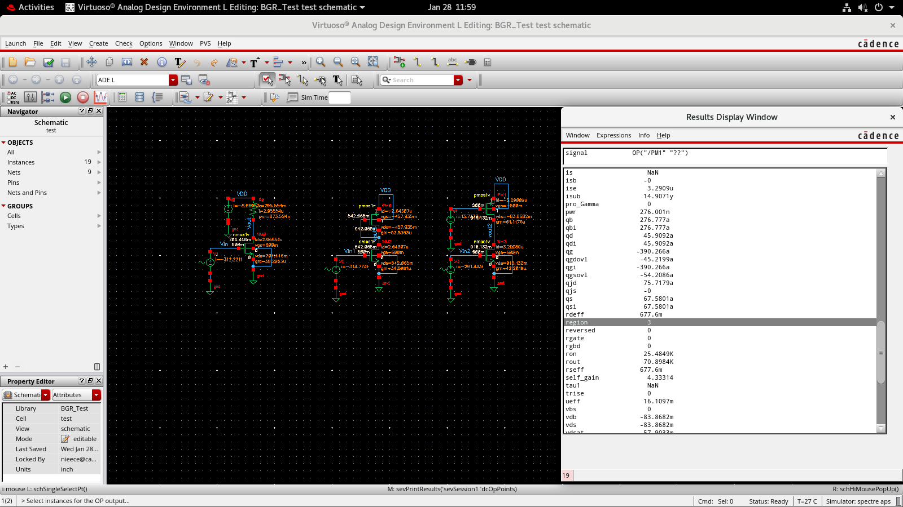
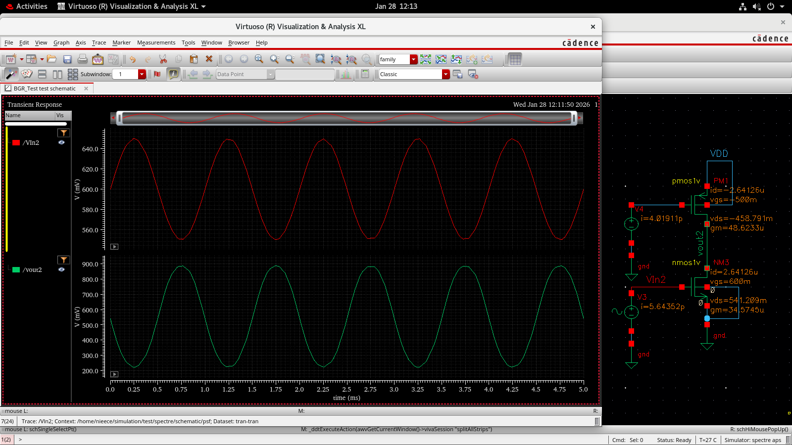

# 📘 Day 2 — Common Source Amplifier & Differential Amplifier Analysis  
**Analog IC Design & Layout Considerations**

---

## 🎯 Objective
- Design and analyze **Common Source (CS) Amplifiers**
- Compare **three circuit variants** to study gain improvement
- Study **DC response, region of operation, and transient behavior**
- Design and simulate a **Differential Amplifier**
- Strengthen understanding of **MOSFET small-signal gain and biasing**

---

## 🔹 Part 1 — Common Source Amplifier Gain Analysis

---

### 📌 Circuit 1 — Basic Common Source Amplifier  
Initial implementation of a standard CS amplifier to observe baseline gain.
Here the size of the resistor is large ang gain Av={-(gm * Rd)}

---

### 📌 Circuit 2 — Improved Gain Configuration  
Modified transistor sizing / biasing to enhance gain performance.
We have replaced the Resistor with a 'diode connected transistor' which now, behaves as a current source.
Here the gain is Av={-gm1 / gm2}. Yet, the gain is not as desired.

---

### 📌 Circuit 3 — Optimized Gain Configuration  
Final optimized CS amplifier with improved gain and operating region stability.
We now give seperate voltage sources to each of the MOSFETs to get the desired gain.

---

## 📊 DC Gain Comparison Across Three Circuits

### 🔹 Gain for 120nm Channel Length

### 🔹 Gain for 1µm Channel Length

---

## 📐 Gain Equation Used

\[
A_v = -g_m \times R_D
\]

Where:
- \( g_m = \frac{2I_D}{V_{OV}} \)
- \( R_D \) = Drain resistance  
- Negative sign indicates **phase inversion**

---

## 🔹 Region of Operation Verification (Circuit 3)

Ensured MOSFET remains in **saturation region** for maximum gain.

---

## ⏱ Transient Response — Circuit 3

Observed time-domain amplification and signal behavior.

---

## 🧪 Three-Circuit Comparison Summary

| Circuit | Modification | Result |
|--------|-------------|--------|
| Circuit 1 | Basic CS | Low baseline gain |
| Circuit 2 | Improved biasing | Higher gain |
| Circuit 3 | Optimized sizing | **Best gain & stability** |

### 📌 Key Insight
- Gain improves with **higher gm**
- Longer channel length increases **output resistance**
- Proper biasing ensures **stable saturation operation**

---

## 🔹 Part 2 — Differential Amplifier Design / Operational Transconductance Amplifier (OTA)

---

### 📌 Differential Amplifier Schematic

---

### 📌 Alternate Schematic View

---

### 📊 Differential Output Response

---

## 📐 Differential Gain Equation

\[
A_d = g_m \times R_D
\]

### Common Mode Rejection Ratio (CMRR)

\[
CMRR = \frac{A_d}{A_{cm}}
\]

---

## 🎓 Key Learnings

### Common Source Amplifier
- Gain depends on **gm and load resistance**
- Channel length affects **gain & output resistance**
- Biasing determines **region of operation**
- Comparing circuit variants improves **design optimization**

### Differential Amplifier
- Amplifies **difference between two inputs**
- Rejects **common-mode noise**
- Core block for **op-amps & analog ICs**

---

## 🛠 Tools Used
- Cadence Virtuoso  
- Spectre Simulator  
- Analog Design Environment (ADE)

---

## 📈 Outcome
Successfully designed and analyzed:
- **Three CS amplifier variants with gain comparison**
- **A functional Differential Amplifier**
- Improved understanding of **analog gain, MOS biasing, and circuit optimization**

---

