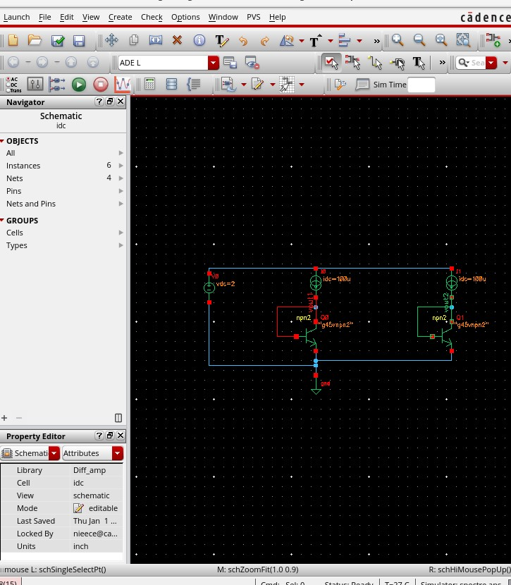
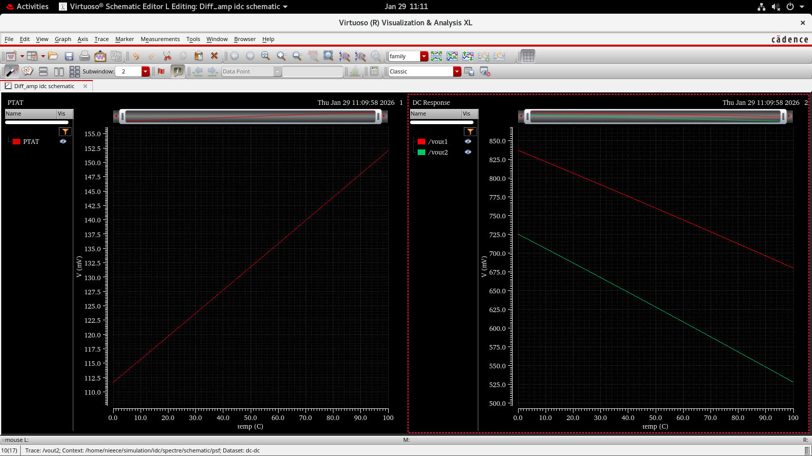
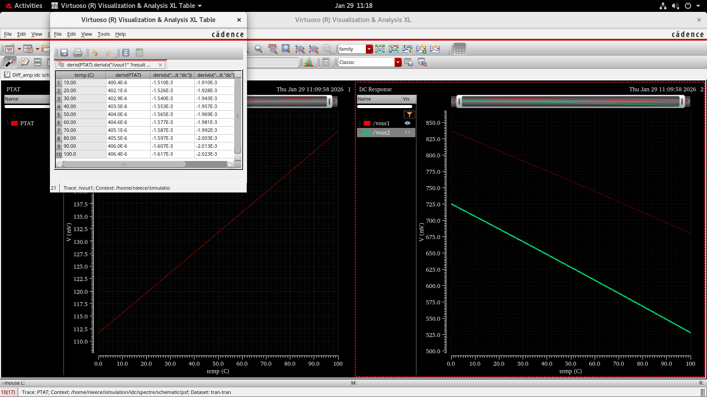
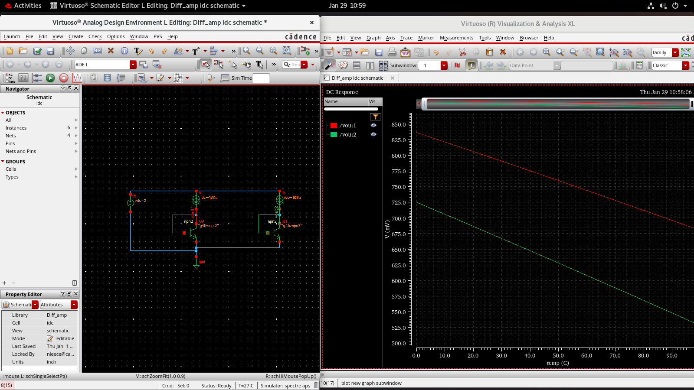
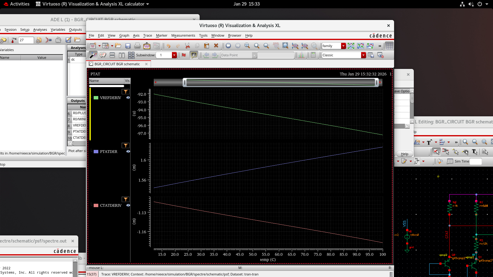
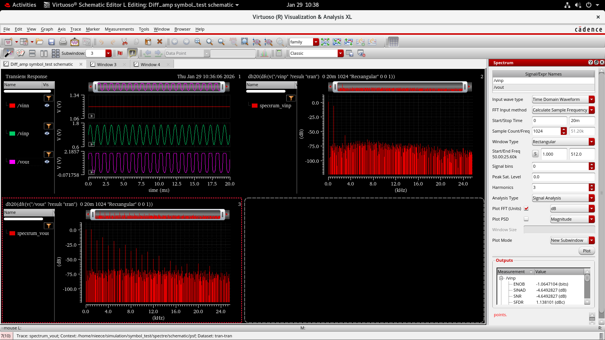

# 📘 Day 3 — Bandgap Reference (BGR) Design & Analysis  
**Cadence Virtuoso | Analog IC Design & Temperature Compensation**

Day 3 focused on the **design, simulation, and validation of a Bandgap Reference (BGR) circuit**, emphasizing **temperature compensation**, **PTAT & CTAT voltage generation**, **reference voltage stabilization**, and **noise spectrum analysis**. The objective was to understand how **temperature-independent reference voltages** are created in real-world analog IC systems.

The first phase of work involved studying **PTAT (Proportional To Absolute Temperature)** and **CTAT (Complementary To Absolute Temperature)** behavior using a **BJT-based core**. A **CTAT voltage** was generated using **VBE**, which decreases as temperature increases. A **PTAT voltage** was generated using **ΔVBE**, which increases with temperature. Temperature sweep simulations were performed to verify these opposite slopes, confirming the foundation of **temperature compensation in bandgap circuits**.

The following schematic and plots illustrate the PTAT & CTAT behavior:

**BGR Core Schematic**  

**PTAT vs CTAT Comparison**  

**Slope Comparison (PTAT vs CTAT)**  

**VBE CTAT Temperature Sweep**  

The second phase focused on implementing a **complete Op-Amp Based Bandgap Reference**, where **PTAT and CTAT voltages were combined using resistor scaling** in a **feedback-stabilized architecture**. The objective was to generate a **temperature-stable reference voltage (VREF ≈ 1.2V)**. The op-amp ensures accurate summation and maintains stability across temperature variations.

The bandgap reference voltage follows the equation:

\[
V_{REF} = V_{BE} + k \cdot \Delta V_{BE}
\]

Where:  
- \( V_{BE} \) is the CTAT component  
- \( \Delta V_{BE} \) is the PTAT component  
- \( k \) is set by resistor ratios  

**Op-Amp Based BGR Schematic**  

**VREF Generation Output Plot**  

To evaluate real-world signal quality, **noise spectrum analysis** was performed on the BGR output. The analysis focused on three key frequency-domain performance metrics:

- **SNR (Signal-to-Noise Ratio)** — Measures signal clarity  
- **SFDR (Spurious-Free Dynamic Range)** — Measures spectral purity  
- **THD (Total Harmonic Distortion)** — Measures harmonic distortion  

Two input amplitude conditions were tested to observe distortion and linearity trends.

**Noise Spectrum — 50 mV Input**  

**Noise Spectrum — 0.5 V Input**  

The results showed that **lower input amplitudes produced cleaner spectral outputs with lower harmonic distortion**, while **higher amplitudes increased THD and spurious tones**. This validated the **robustness and signal integrity of the BGR output**.

### Key Learnings from Day 3  
- Practical understanding of **PTAT and CTAT voltage generation**  
- How **ΔVBE enables temperature compensation**  
- Real-world implementation of a **Bandgap Reference circuit**  
- Generating a **temperature-stable VREF** using resistor scaling and op-amp feedback  
- Performing **noise spectrum analysis using SNR, SFDR, and THD**  
- Hands-on experience with **Cadence Virtuoso simulation, debugging, and validation**  

### Tools Used  
- Cadence Virtuoso  
- Spectre Simulator  
- Analog Design Environment (ADE)

### Summary  
Day 3 strengthened practical knowledge in **Analog IC Reference Design**, **Temperature Compensation Techniques**, and **Noise Performance Evaluation**, providing hands-on experience in designing a **production-relevant Bandgap Reference circuit** used in power management, ADCs, DACs, and precision analog systems.
