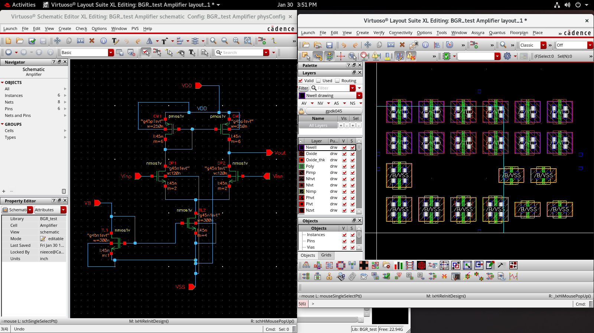

# Day 4 & Day 5 — Analog IC Layout, CMOS Fabrication & Differential Amplifier Physical Design  
**Cadence Virtuoso | Analog IC Design & Layout Considerations**

---

## Overview  
Days 4 and 5 focused on building a **strong foundation in Analog IC Layout**, understanding the **CMOS fabrication process**, and performing **hands-on physical design of a Differential Amplifier in Cadence Virtuoso**.

These sessions emphasized how **layout decisions directly affect circuit performance**, highlighting **matching, symmetry, parasitic minimization, and silicon-aware design practices**.

---

## Key Learning Domains  

---

## 1. CMOS Cross-Section & Fabrication Process  

Studied the **physical structure of NMOS and PMOS devices** and major CMOS fabrication steps:

- Wafer preparation  
- Thermal oxidation  
- Photolithography  
- Ion implantation & doping  
- Etching and thin-film deposition  
- Metal interconnect formation  
- Passivation & packaging  

### Layout Layer Understanding  

### Full Layer Stack View  

**Key Insight:**  
Understanding how fabrication maps to layout layers improves **design realism and accuracy**.

---

## 2. Role of Layout in the IC Design Flow  

Learned how layout integrates into the **end-to-end IC design pipeline**:

1. Circuit specification  
2. Schematic design  
3. Pre-layout simulation  
4. Layout implementation  
5. DRC (Design Rule Check)  
6. LVS (Layout vs Schematic)  
7. Parasitic extraction  
8. Post-layout simulation  
9. Tape-out (GDSII generation)

**Key Takeaway:**  
> Layout is not just geometry — it **defines performance, yield, noise, and reliability**.

---

## 3. Floorplanning, Grouping & Placement Strategies  

Learned best practices for **analog-optimized floorplanning**:

- Functional block partitioning  
- Noise-aware placement  
- Keeping sensitive nodes isolated  
- Area-efficient routing  
- Organized device grouping  

### Grouping Strategy  

### Grouping with Dummy Devices  

---

## 4. Matching Techniques & Layout Symmetry  

Focused on **high-precision analog layout methods**:

### Techniques Used  
- Common-centroid placement  
- Interdigitated transistor arrangement  
- Dummy device insertion  
- Gradient & stress error reduction  
- Symmetric routing paths  

### Alignment for Matching  

**Why Matching Matters:**  
Mismatch impacts:
- Offset voltage  
- Gain accuracy  
- Noise  
- Thermal stability  

---

## 5. Fingers vs Multipliers in Transistor Layout  

| Parameter | Fingers | Multipliers |
|---------|--------|------------|
| Area efficiency | Moderate | Higher |
| Matching | Better | Moderate |
| Parasitics | Lower | Higher |
| Resistance | Lower | Higher |

**Conclusion:**  
> Fingered devices improve **matching, symmetry, and analog accuracy**.

---

## 6. Hands-On Project — Differential Amplifier Design  

### Differential Amplifier Schematic  

---

### Core Differential Gain Equation  

\[
A_d = g_m \cdot R_D
\]

### Transconductance Equation  

\[
g_m = \frac{2I_D}{V_{OV}}
\]

Where:  
- \( I_D \) = Drain current  
- \( V_{OV} \) = Overdrive voltage  
- \( R_D \) = Load resistance  

---

## 7. Differential Amplifier Layout Implementation  

### Layout Objectives  
- Maintain **symmetry between input devices**  
- Apply **common-centroid placement**  
- Minimize parasitic mismatch  
- Ensure clean and balanced routing  

### Differential Amplifier Layout  

---

## 8. Guard Ring Integration for Noise Isolation  

Guard rings were used to **reduce substrate noise coupling** and improve **analog signal integrity**.

---

## 9. Routing Strategy & Parasitic Minimization  

### DRC Before Routing  

### Oxide & Layer Planning  

### Post-Routing DRC Clean Layout  

**Key Insight:**  
> Poor routing increases **capacitance, resistance, noise, and gain degradation**.

---

## 10. DRC & LVS Verification  

Ensured **manufacturing correctness** and **schematic consistency**:

- Design Rule Check (DRC)  
- Layout vs Schematic (LVS)  
- Clean geometry validation  

---

## 11. Parasitic Awareness & Post-Layout Learning  

Studied layout impact on:
- Bandwidth roll-off  
- Gain variation  
- Offset voltage  
- Noise performance  
- Circuit stability  

**Core Lesson:**  
> A perfect schematic can fail if the layout is weak.

---

## Tools & Technology Used  

- Cadence Virtuoso  
- CMOS Process Design Kit (PDK)  
- Analog Design Environment (ADE)  
- DRC / LVS Verification Tools  

---

## Key Outcomes  

- Strong foundation in **Analog IC Layout Principles**  
- Hands-on experience designing a **Differential Amplifier Layout**  
- Understanding of **matching, symmetry & parasitic control**  
- Confidence using **Cadence Virtuoso for layout workflows**  
- Industry-ready mindset for **Analog / Mixed-Signal / VLSI roles**

---

## Summary  

Days 4 & 5 significantly strengthened my **layout expertise, fabrication understanding, and analog design intuition**, bridging the gap between **schematic-level theory and silicon-level realization**.

This marks a major step toward becoming a **professional Analog IC & VLSI Engineer**.

---
