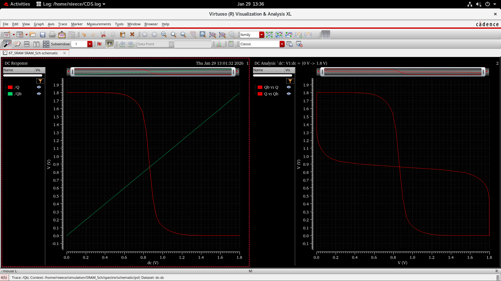

# 🧠 Individual Project: 6T SRAM Cell Design and Analysis  
**Analog IC Design & Layout Considerations Workshop**

This repository contains my **independent individual project on 6T SRAM (Static Random Access Memory) cell design**, completed and submitted **by the end of the workshop**. The entire circuit design, simulation, analysis, and documentation were carried out **solely by me**, demonstrating hands-on experience in **memory circuit design, transistor-level optimization, and stability analysis**.

This project focuses on understanding **SRAM architecture, read/write behavior, noise margins, stability challenges, transistor sizing trade-offs, and real-world memory design constraints** commonly used in semiconductor and VLSI industries.

---

## ⭐ Project Highlight  
✔ Fully **self-driven individual project**  
✔ Designed, simulated, and validated **independently**  
✔ Completed and submitted **within the workshop timeline**  
✔ Demonstrates **VLSI memory design and circuit analysis skills**  
✔ Strong relevance to **Analog IC, VLSI, and Semiconductor roles**

---

## 🧩 6T SRAM Cell Architecture  

A **6-Transistor SRAM cell** consists of:
- Two cross-coupled CMOS inverters that store data  
- Two access NMOS transistors controlled by the **Word Line (WL)**  
- Two Bit Lines (**BL and BL̅**) used for read and write operations  

The feedback loop formed by the inverters allows the SRAM cell to **retain stored data without refresh**, making it ideal for cache memory applications.

---

## 📷 6T SRAM Schematic  

---

## ⚙️ Operating Modes  

### 📝 Hold Mode  
- Word Line (WL) = LOW  
- Access transistors OFF  
- Stored data is retained through inverter feedback  

### ✍️ Write Mode  
- Word Line (WL) = HIGH  
- Bit Lines force logic levels into storage nodes  
- Data overwrites previous stored state  

### 📖 Read Mode  
- Word Line (WL) = HIGH  
- Stored data is sensed through voltage difference on Bit Lines  
- Sense amplifier detects output  

---

## 📈 Static Noise Margin (SNM) Analysis  

Static Noise Margin (SNM) evaluates **cell stability and robustness** against noise.

### 📷 Butterfly Curve for SNM  

### 📐 Observations  
- Larger SNM indicates **higher stability**  
- SNM is affected by transistor sizing, supply voltage, and device mismatch  
- Proper ratioing improves read stability and writability  

---

## 📏 Transistor Sizing and Design Considerations  

Key trade-offs analyzed in this project include:
- Strong pull-down NMOS to prevent read disturb  
- Proper access transistor sizing to enable successful writes  
- Balanced PMOS strength to maintain stored logic  
- Stability vs speed vs power optimization  

---

## 🛠 Tools Used  

- **LTSpice / Cadence / Ngspice** for circuit simulation  
- **Transient and DC analysis** for waveform validation  
- **Noise Margin analysis** for stability evaluation  
- **GitHub Markdown** for documentation and portfolio building  

---

## 🎯 Learning Outcomes  

Through this independent project, I gained strong hands-on experience in:
- SRAM cell architecture and operation  
- Memory stability challenges and failure mechanisms  
- Read/write timing and signal integrity  
- Static Noise Margin and reliability metrics  
- Device sizing and performance trade-offs  
- Industry-style memory design workflow  

---

## 🏁 Project Completion Statement  

This **6T SRAM Cell Design Project was independently completed, simulated, validated, and submitted** as part of the workshop deliverables.  
It reflects **self-initiative, strong circuit design fundamentals, problem-solving ability, and practical understanding of memory system design**, making it a **portfolio-worthy demonstration of real-world VLSI skills**.

---

## 📌 Author  

**Dhruthi S**  
Electronics & Communication Engineering  
Analog IC Design | VLSI | PCB Design | Semiconductor Enthusiast  

---

## ⭐ If you find this project useful  
Give this repository a ⭐ and feel free to explore the rest of my Analog IC Design work!
